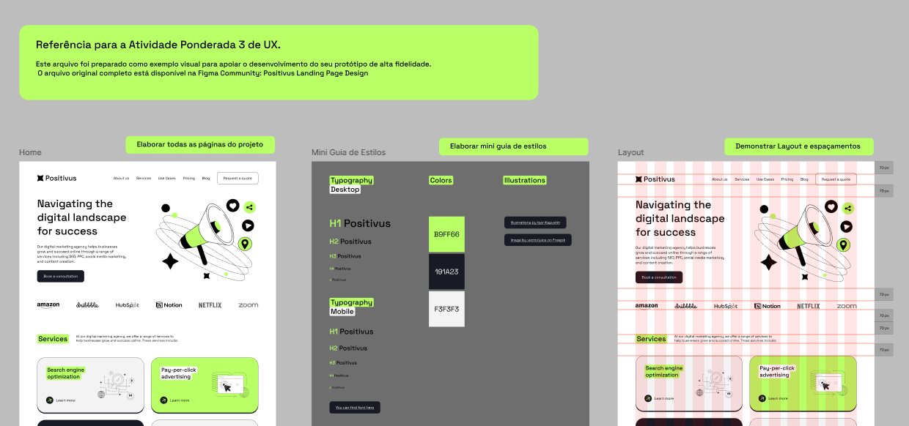

# Projeto Individual (UX Parte 3): Protótipo de Alta Fidelidade + Guia de Estilos

## Objetivo

Construir um **protótipo de alta fidelidade** para o sistema proposto no seu projeto individual, com base nos wireframes desenvolvidos anteriormente. Além disso, documentar um **mini guia de estilos**, organizando visualmente os padrões adotados na interface.

## Entrega
- Inserir imagens das telas do protótipo e o guia de estilos na seção 3.5 do arquivo `PI-WAD.md`
- Inserir o link do repositório no card da AdaLove

**Prazo de Entrega:** até sexta-feira, 23h59

---

## Instruções

### 1. Protótipo de Alta Fidelidade

Desenvolva o protótipo de alta fidelidade das telas principais do seu sistema. A recomendação é usar o **Figma**, por sua praticidade, organização de componentes e possibilidade de replicar estilos. Também é possível usar outras ferramentas de design (Photoshop, Illustrator, Canva, etc.), desde que as imagens geradas sejam claras, em alta resolução e bem apresentadas na documentação.

> O protótipo **não precisa ser interativo, nem navegável**. No entanto, a apresentação visual das telas deve permitir compreender os fluxos principais de navegação e uso do sistema.

Caso deseje, você pode também:
- Criar um fluxo navegável diretamente no Figma - e indicar o link para essa navegação na documentação do projeto;
- Organizar um conjunto de estilos e componentes no Figma (será demonstrado durante o desenvolvimento).

As imagens das telas devem ser incluídas no `PI-WAD.md`, preferencialmente organizadas na ordem de uso.

### 2. Mini Guia de Estilos

Além do protótipo, elabore um mini guia com os principais padrões visuais usados no seu sistema.

Inclua pelo menos:

- **Layout geral** (margens, espaçamentos padrão, colunas, grids)
- **Tipografia** (tamanhos, pesos e tipos de fonte)
- **Cores** (códigos ou nomes das cores principais e secundárias)
- **Botões** (estados, tamanhos, variações)
- **Assets** (ícones, ilustrações, outros elementos visuais recorrentes)

Você pode adicionar imagens, capturas de tela ou quadros criados diretamente no Figma para ilustrar esse guia. A documentação pode ser inserida como imagens ou links complementares no `PI-WAD.md`.

### 3. Exemplo Projeto no Figma

Elaboramos uma versão reduzida de um protótipo de alta fidelidade encontrado na Comunidade Figma e deixamos disponível como exemplo para vocês. Acesse aqui a [Referência para a Atividade Ponderada 3 de UX](https://www.figma.com/design/VSY3yMxGoDbEI16SldusjL/Refer%C3%AAncia-para-a-Atividade-Ponderada-3-de-UX.?node-id=25-145&t=HXeq6RI8UUhn6BuM-1).

### ✅ Checklist antes de enviar

- [ ] As telas do protótipo estão representadas visualmente na seção 3.5 do `PI-WAD.md`?
- [ ] O protótipo segue as funcionalidades previstas nas User Stories e wireframes anteriores? As alterações foram justificadas?
- [ ] O mini guia de estilos foi incluído com os tópicos obrigatórios?
- [ ] O link do repositório foi inserido no card da AdaLove?
